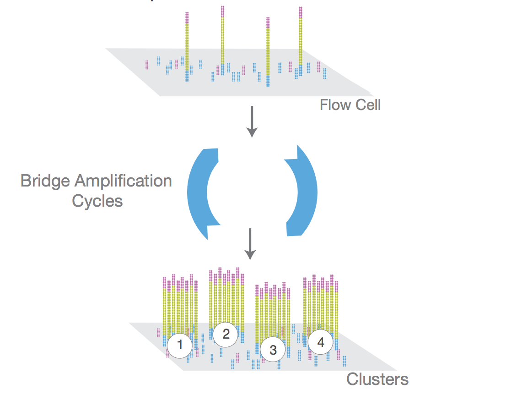
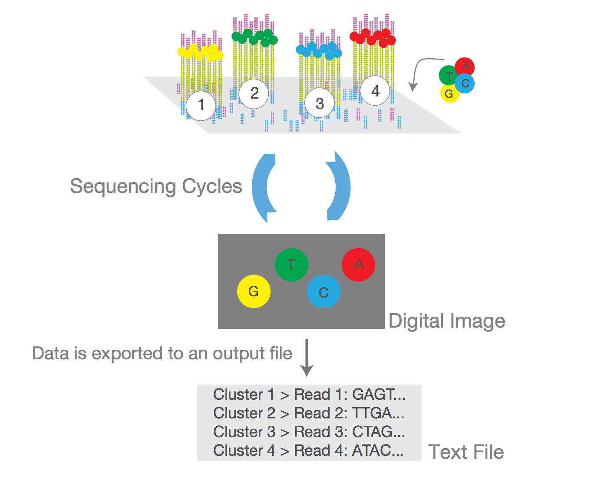
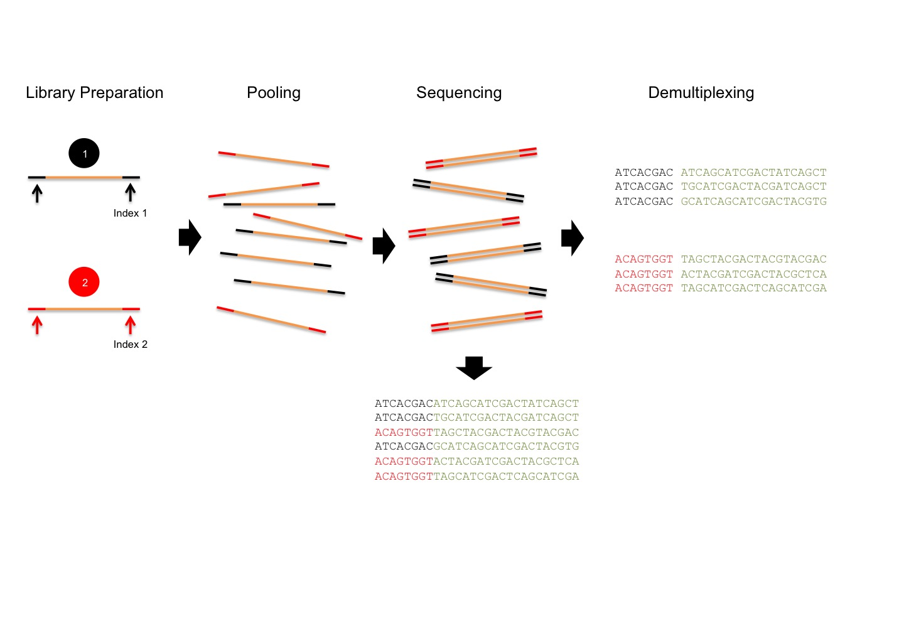
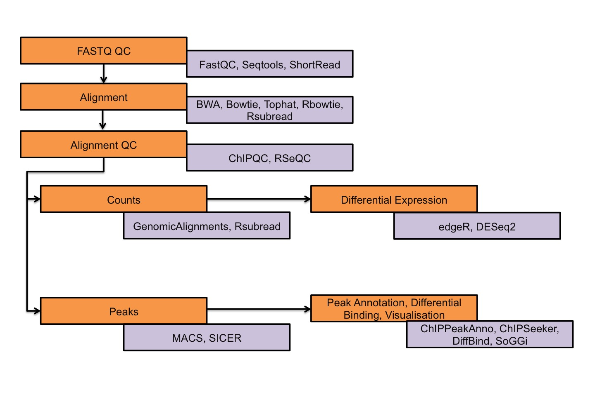
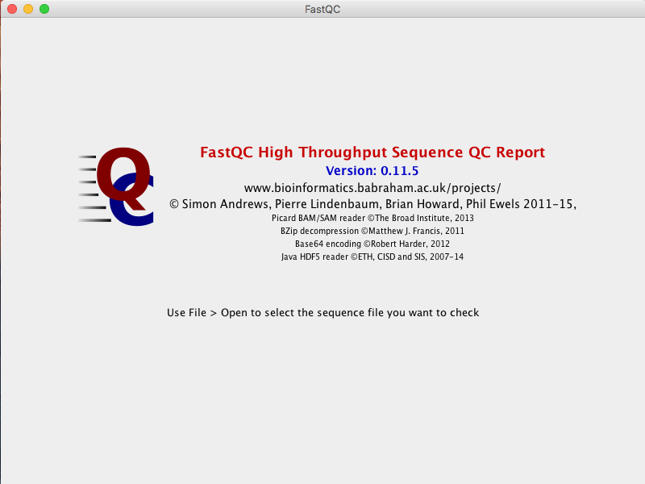
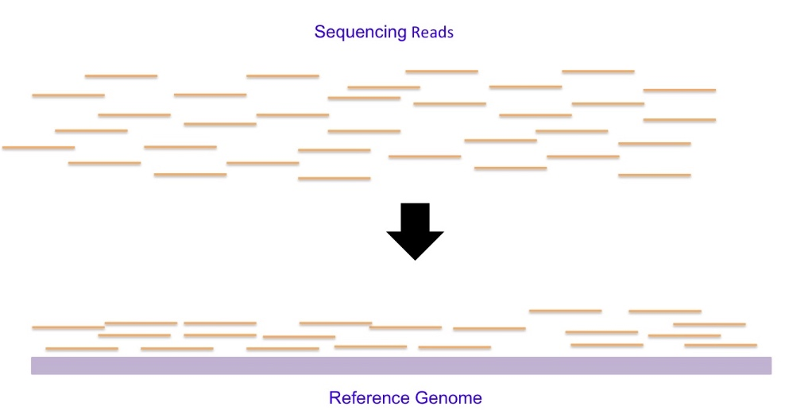
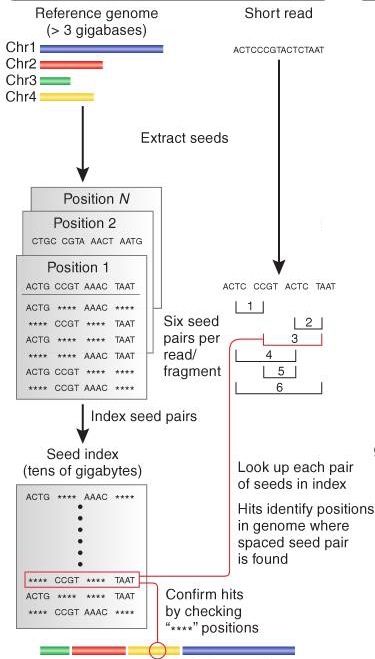
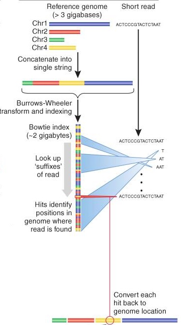
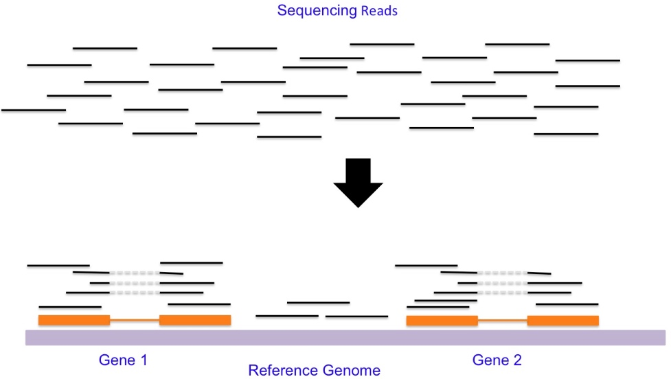

Sequence Alignment Tutorial
========================================================
css: Rpress.css
author: "MRC CSC Bioinformatics Core Team"
date:http://mrccsc.github.io/training.html
width: 1440
height: 1100
autosize: true
font-import: <link href='http://fonts.googleapis.com/css?family=Slabo+27px' rel='stylesheet' type='text/css'>
font-family: 'Slabo 27px', serif;
css:style.css


MRC CSC Training Resources
========================================================
* [Reproducible R](http://mrccsc.github.io/Reproducible-R/)
* [Intermediate R - Data analysis sand Visualisation](http://bioinformatics-core-shared-training.github.io/r-intermediate/)
* [Statistics in R](http://mrccsc.github.io/StatisticsInR/)
* [Genomic File Formats](http://mrccsc.github.io/genomic_formats/)
* [ChIP-seq (short)](http://mrccsc.github.io/ChIPseq_short/)
* [RNA-seq (short)](http://mrccsc.github.io/RNAseq_short/)

Overview
========================================================

* [Introduction to Seqeuncing Technology](#/Intro)
* [Revisiting File Formats](#/FileFormat)
* [Quality Assessment of Sequencing](#/SeqQC)
* [Introduction to Alignment](#/align)
* [Aligning Sequences](#/align2)
* [Sorting and indexing](#/Sorting)
* [Summary & Post-Alignment QC](#/QC)
* [Reading BAM/SAM](#/readbam)
* [Visualisation](#/vis)


Downloading data
========================================================

https://fileexchange.imperial.ac.uk/pickup.php?claimID=ZHffVJvNFHZmHzP2&claimPasscode=7ZKDxfcdYG2dac8M&emailAddr=gdharmal%40imperial.ac.uk

- Download the zip and unzip under "course" directory (this will create a new directory "Data")


Introduction to Seqeuncing Technology
========================================================
id: Intro

Illumina - Sequencing by synthesis



#### Image Source: Illumina Inc

Introduction to Seqeuncing Technology
========================================================



Image Source: Illumina Inc


Introduction to Seqeuncing Technology
========================================================




Revisiting File Formats
========================================================
type: section
id: FileFormat


Revisiting File Formats
========================================================

## Genomic File Format Course
<br><br><br>
## http://mrccsc.github.io/genomic_formats/genomicFileFormats.html


Quality Assessment of Sequencing
========================================================
type: section
id: SeqQC


Quality Assessment of Sequencing
========================================================

### Tools for Alignment & QC


Quality Assessment of Sequencing
========================================================
- Summary
- Quality score distribtion (5' to 3')
- Adapter contamination
- GC Content
- Distribution of A/T/G/C along the sequence


Quality Assessment of Sequencing
========================================================

### R Packages: ShortRead, Rqc, SeqTools

<br>
### Quality assessment using ShortRead

<br> Key Functions in ShortRead
- <b>FastqStreamer</b> Iterate through FASTQ files in chunks
- <b>readFastq</b> Read an entire FASTQ file into memory
- <b>alphabetFrequency</b> Nucleotide or quality score use per read
- <b>alphabetByCycle</b> Nucleotide or quality score use by cycle
- <b>report</b> Generate a quality assessment report


```r
library(ShortRead)

fastqfile <- system.file(package="ShortRead", "extdata", "E-MTAB-1147","ERR127302_1_subset.fastq.gz")
fq <- readFastq(fastqfile)
```

Quality Assessment of Sequencing
========================================================

### Exploring sequences and Quality Scores

```r
fq
```

```
class: ShortReadQ
length: 20000 reads; width: 72 cycles
```

```r
head(sread(fq), 2)
```

```
  A DNAStringSet instance of length 2
    width seq
[1]    72 GTCTGCTGTATCTGTGTCGGCTGTCTCGCGG...CAATGAAGGCCTGGAATGTCACTACCCCCAG
[2]    72 CTAGGGCAATCTTTGCAGCAATGAATGCCAA...GTGGCTTTTGAGGCCAGAGCAGACCTTCGGG
```

```r
head(quality(fq), 2)
```

```
class: FastqQuality
quality:
  A BStringSet instance of length 2
    width seq
[1]    72 HHHHHHHHHHHHHHHHHHHHEBDBB?B:BBG...FEFBDBD@DDECEE3>:?;@@@>?=BAB?##
[2]    72 IIIIHIIIGIIIIIIIHIIIIEGBGHIIIIH...IHIIIHIIIIIGIIIEGIIGBGE@DDGGGIG
```

Quality Assessment of Sequencing
========================================================

### Quality assessment Report

```r
qaSummary <- qa(fastqfile, type="fastq")
browseURL(report(qaSummary))
```


Quality Assessment of Sequencing
========================================================

<br><br>
### Non-R approach: FASTQC

- Handles FASTQ, BAM and SAM Files
- Provies summary table and graphs
- Exports results in HTML
- GUI & ability to run multiple FASTQ in offline mode

### Webpage: http://www.bioinformatics.babraham.ac.uk/projects/fastqc/


Quality Assessment of Sequencing
========================================================



Quality Assessment of Sequencing
========================================================


Adapter & Quality Trimming
========================================================

- Seqtk (https://github.com/lh3/seqtk)
- Trimmomatic (http://www.usadellab.org/cms/?page=trimmomatic)
- Cutadpat (https://github.com/marcelm/cutadapt)
- TrimGalore! - Wrapper for Cutadapt (http://www.bioinformatics.babraham.ac.uk/projects/trim_galore/)


Time for Exercises!
========================================================
* [Exercises Part1](./AlignmentExercise1.html)
<br><br>

* [Exercises Part1 Solutions](./AlignmentExercise1_Solutions.html)


Sequence Alignment
========================================================
type: section
id: align


Sequence Alignment
========================================================



### Challenges
- Millions of short reads (36bp to 100bp)
- Identifying unique positions in the genome
- Repetitive regions in the genome
- Orientation of reads relative to genome is not known
- Sequencing reads have error

Sequence Alignment
========================================================

### How to
- Align reads efficiently in terms of memory and time?
- Account for mismatches and repeat regions 


<br><br>
### Two approaches
- Spaced seed and Extend
    + MAQ
    + BFAST
    + SHRiMP
- Burrows-Wheeler transform (BWT)
    + BWA
    + Bowtie


Spaced Seed & Extend
========================================================



- Reference genome cut in to small "seeds"
- Pairs of spaced seeds are stored in index (lookup table)
- Seqeucning reads cut into 4 equal parts (read seeds)
- Seed pairs are used as keys to search the lookup table

#### Image: Nature Biotechnology 2009 27(5): 455-457

Burrows-Wheeler transform (BWT)
========================================================



- BWT helps to index entire human genome in less than 2 gb memory
- Aligner matches end of reads against the index (increasing one base at a time)
- If no perfect alignment found,  back up and try again with substitution
- Breakdown approach: First solving simple sub-problem (aligning one base) and use that to solve slighly harder problem (aligning two base)
- ~30 fold faster than spaced seed methods

#### Image: Nature Biotechnology 2009 27(5): 455-457

Spliced read aligners
========================================================




- Aligning transcript reads to genome (reads overlapping with splice junction)
- With or without known splice junction databases
- Aligners: Tophat, STAR, MapSplice


Aligning Sequences
========================================================
type: section
id: align2


Aligning sequences with Rbowtie
========================================================

### Required Input
- Genome fasta
- Sequencing reads (fastq)
- User specified parameters 

<br><br><br>
### Data

- ChIPseq of CTCF, bone marrow macrophage (Mus musculus) from ENCODE (https://www.encodeproject.org/experiments/ENCSR000CFJ/)
- Reads from chr1 used for this exercise

Aligning sequences with Rbowtie
========================================================

### Building Index for the genome

#### Help for building index: bowtie_build_usage()


```r
library(Rbowtie)
bowtie_build_usage()
 [1] "Usage: bowtie2-build-s [options]* <reference_in> <ebwt_outfile_base>"            
 [2] "    reference_in            comma-separated list of files with ref sequences"    
 [3] "    ebwt_outfile_base       write Ebwt data to files with this dir/basename"     
 [4] "Options:"                                                                        
 [5] "    -f                      reference files are Fasta (default)"                 
 [6] "    -c                      reference sequences given on cmd line (as <seq_in>)" 
 [7] "    -C/--color              build a colorspace index"                            
 [8] "    -a/--noauto             disable automatic -p/--bmax/--dcv memory-fitting"    
 [9] "    -p/--packed             use packed strings internally; slower, uses less mem"
[10] "    --bmax <int>            max bucket sz for blockwise suffix-array builder"    
[11] "    --bmaxdivn <int>        max bucket sz as divisor of ref len (default: 4)"    
[12] "    --dcv <int>             diff-cover period for blockwise (default: 1024)"     
[13] "    --nodc                  disable diff-cover (algorithm becomes quadratic)"    
[14] "    -r/--noref              don't build .3/.4.ebwt (packed reference) portion"   
[15] "    -3/--justref            just build .3/.4.ebwt (packed reference) portion"    
[16] "    -o/--offrate <int>      SA is sampled every 2^offRate BWT chars (default: 5)"
[17] "    -t/--ftabchars <int>    # of chars consumed in initial lookup (default: 10)" 
[18] "    --ntoa                  convert Ns in reference to As"                       
[19] "    --seed <int>            seed for random number generator"                    
[20] "    -q/--quiet              verbose output (for debugging)"                      
[21] "    -h/--help               print detailed description of tool and its options"  
[22] "    --usage                 print this usage message"                            
[23] "    --version               print version information and quit"                  
```

Aligning sequences with Rbowtie
========================================================

### Building Index


```r
refFasta <- list.files(path="Data",pattern="chr1.fa$", full=T)
tmp <- bowtie_build(references=refFasta, outdir="Data", prefix="mm9index_chr1", force=TRUE)
```

Aligning sequences with Rbowtie
========================================================

#### Help for aligning sequences: bowtie_usage()


```r
bowtie_usage()
 [1] "Usage: "                                                                          
 [2] "bowtie-build-s [options]* <ebwt> {-1 <m1> -2 <m2> | --12 <r> | <s>} [<hit>]"      
 [3] ""                                                                                 
 [4] "  <m1>    Comma-separated list of files containing upstream mates (or the"        
 [5] "          sequences themselves, if -c is set) paired with mates in <m2>"          
 [6] "  <m2>    Comma-separated list of files containing downstream mates (or the"      
 [7] "          sequences themselves if -c is set) paired with mates in <m1>"           
 [8] "  <r>     Comma-separated list of files containing Crossbow-style reads.  Can be" 
 [9] "          a mixture of paired and unpaired.  Specify \"-\" for stdin."            
[10] "  <s>     Comma-separated list of files containing unpaired reads, or the"        
[11] "          sequences themselves, if -c is set.  Specify \"-\" for stdin."          
[12] "  <hit>   File to write hits to (default: stdout)"                                
[13] "Input:"                                                                           
[14] "  -q                 query input files are FASTQ .fq/.fastq (default)"            
[15] "  -f                 query input files are (multi-)FASTA .fa/.mfa"                
[16] "  -r                 query input files are raw one-sequence-per-line"             
[17] "  -c                 query sequences given on cmd line (as <mates>, <singles>)"   
[18] "  -C                 reads and index are in colorspace"                           
[19] "  -Q/--quals <file>  QV file(s) corresponding to CSFASTA inputs; use with -f -C"  
[20] "  --Q1/--Q2 <file>   same as -Q, but for mate files 1 and 2 respectively"         
[21] "  -s/--skip <int>    skip the first <int> reads/pairs in the input"               
[22] "  -u/--qupto <int>   stop after first <int> reads/pairs (excl. skipped reads)"    
[23] "  -5/--trim5 <int>   trim <int> bases from 5' (left) end of reads"                
[24] "  -3/--trim3 <int>   trim <int> bases from 3' (right) end of reads"               
[25] "  --phred33-quals    input quals are Phred+33 (default)"                          
[26] "  --phred64-quals    input quals are Phred+64 (same as --solexa1.3-quals)"        
[27] "  --solexa-quals     input quals are from GA Pipeline ver. < 1.3"                 
[28] "  --solexa1.3-quals  input quals are from GA Pipeline ver. >= 1.3"                
[29] "  --integer-quals    qualities are given as space-separated integers (not ASCII)" 
[30] "Alignment:"                                                                       
[31] "  -v <int>           report end-to-end hits w/ <=v mismatches; ignore qualities"  
[32] "    or"                                                                           
[33] "  -n/--seedmms <int> max mismatches in seed (can be 0-3, default: -n 2)"          
[34] "  -e/--maqerr <int>  max sum of mismatch quals across alignment for -n (def: 70)" 
[35] "  -l/--seedlen <int> seed length for -n (default: 28)"                            
[36] "  --nomaqround       disable Maq-like quality rounding for -n (nearest 10 <= 30)" 
[37] "  -I/--minins <int>  minimum insert size for paired-end alignment (default: 0)"   
[38] "  -X/--maxins <int>  maximum insert size for paired-end alignment (default: 250)" 
[39] "  --fr/--rf/--ff     -1, -2 mates align fw/rev, rev/fw, fw/fw (default: --fr)"    
[40] "  --nofw/--norc      do not align to forward/reverse-complement reference strand" 
[41] "  --maxbts <int>     max # backtracks for -n 2/3 (default: 125, 800 for --best)"  
[42] "  --pairtries <int>  max # attempts to find mate for anchor hit (default: 100)"   
[43] "  -y/--tryhard       try hard to find valid alignments, at the expense of speed"  
[44] "  --chunkmbs <int>   max megabytes of RAM for best-first search frames (def: 64)" 
[45] "Reporting:"                                                                       
[46] "  -k <int>           report up to <int> good alignments per read (default: 1)"    
[47] "  -a/--all           report all alignments per read (much slower than low -k)"    
[48] "  -m <int>           suppress all alignments if > <int> exist (def: no limit)"    
[49] "  -M <int>           like -m, but reports 1 random hit (MAPQ=0); requires --best" 
[50] "  --best             hits guaranteed best stratum; ties broken by quality"        
[51] "  --strata           hits in sub-optimal strata aren't reported (requires --best)"
[52] "Output:"                                                                          
[53] "  -t/--time          print wall-clock time taken by search phases"                
[54] "  -B/--offbase <int> leftmost ref offset = <int> in bowtie output (default: 0)"   
[55] "  --quiet            print nothing but the alignments"                            
[56] "  --refout           write alignments to files refXXXXX.map, 1 map per reference" 
[57] "  --refidx           refer to ref. seqs by 0-based index rather than name"        
[58] "  --al <fname>       write aligned reads/pairs to file(s) <fname>"                
[59] "  --un <fname>       write unaligned reads/pairs to file(s) <fname>"              
[60] "  --max <fname>      write reads/pairs over -m limit to file(s) <fname>"          
[61] "  --suppress <cols>  suppresses given columns (comma-delim'ed) in default output" 
[62] "  --fullref          write entire ref name (default: only up to 1st space)"       
[63] "Colorspace:"                                                                      
[64] "  --snpphred <int>   Phred penalty for SNP when decoding colorspace (def: 30)"    
[65] "     or"                                                                          
[66] "  --snpfrac <dec>    approx. fraction of SNP bases (e.g. 0.001); sets --snpphred" 
[67] "  --col-cseq         print aligned colorspace seqs as colors, not decoded bases"  
[68] "  --col-cqual        print original colorspace quals, not decoded quals"          
[69] "  --col-keepends     keep nucleotides at extreme ends of decoded alignment"       
[70] "SAM:"                                                                             
[71] "  -S/--sam           write hits in SAM format"                                    
[72] "  --mapq <int>       default mapping quality (MAPQ) to print for SAM alignments"  
[73] "  --sam-nohead       supppress header lines (starting with @) for SAM output"     
[74] "  --sam-nosq         supppress @SQ header lines for SAM output"                   
[75] "  --sam-RG <text>    add <text> (usually \"lab=value\") to @RG line of SAM header"
[76] "Performance:"                                                                     
[77] "  -o/--offrate <int> override offrate of index; must be >= index's offrate"       
[78] "  -p/--threads <int> number of alignment threads to launch (default: 1)"          
[79] "  --mm               use memory-mapped I/O for index; many 'bowtie's can share"   
[80] "  --shmem            use shared mem for index; many 'bowtie's can share"          
[81] "Other:"                                                                           
[82] "  --seed <int>       seed for random number generator"                            
[83] "  --verbose          verbose output (for debugging)"                              
[84] "  --version          print version information and quit"                          
[85] "  -h/--help          print this usage message"                                    
```


Aligning sequences with Rbowtie
========================================================


```r
bowtie(sequences="Data/ENCFF001LGM_chr1.fastq",
       index=file.path("Data", "mm9index_chr1"), 
       outfile="Data/CTCF_mm9_MF.sam",
       sam=TRUE, 
       best=TRUE, 
       force=TRUE,
       threads=2,
       type="single", m=1
       )
```


```r
# reads processed: 975396
# reads with at least one reported alignment: 967484 (99.19%)
# reads that failed to align: 7340 (0.75%)
# reads with alignments suppressed due to -m: 572 (0.06%)
# Reported 967484 alignments to 1 output stream(s)
```


Spliced Alignment using SpliceMap
========================================================

- To generate spliced alignments (RNA-Seq)
- SpliceMap uses bowtie
- Accepts paramets as named list
- Limitation: reads should be at least 50bp


### Data
- RNA-Seq of Liver (Mus musculus E12.5) from ENCODE: https://www.encodeproject.org/experiments/ENCSR648YEP/
- Single end
- Reads from chr1 used for this exercise


Spliced Alignment using SpliceMap
========================================================

### Aligning the sequences using SpliceMap


```r
readsFiles <- "Data/ENCFF905YGD_chr1.fastq"
refDir <- "Data/chr1.fa"
samFiles <- "Data/ENCFF905YGD_chr1.sam"
cfg <- list(genome_dir=refDir,
            reads_list1=readsFiles,
            read_format="FASTQ",
            quality_format="phred-33",
            outfile=samFiles,
            temp_path=tempdir(),
            max_intron=400000,
            max_multi_hit=10,
            seed_mismatch=1,
            read_mismatch=2,
            num_chromosome_together=2,
            bowtie_base_dir="Data/mm9index_chr1",
            num_threads=4,
            try_hard="yes",
            selectSingleHit=TRUE)
res <- SpliceMap(cfg)
```


Sorting & Indexing
========================================================
type: section
id: Sorting


Sorting & Indexing the SAM/BAM
========================================================

<br><br>
### Sorting SAM/BAM

- Most post-processing methods requires reads sorted by aligned position
- Sorted and indexed large files enable random access of required genomic regions

### Tools
- R: Rsamtools
- Non-R: samtools, Picard


Sorting & Indexing the SAM/BAM
========================================================
<br><br>
### Convert SAM to BAM

- `asBam` converts SAM to BAM, sort and index

```r
library(Rsamtools)
insam <- "Data/CTCF_mm9_MF.sam"
outbam <- "Data/CTCF_mm9_MF"
asBam(insam, outbam, overwrite=T)
```

- Sorting and Indexing a BAM

```r
sortBam(InputBAM, SortedBAM, byQname=F, maxMemory=512)
indexBam(SortedBAM)
```


Few key functions in Rsamtools
========================================================

- <b>scanBamHeader</b>: Read the SAM header section
- <b>countBam</b>: Count number reads (accepts `ScanBamParam` object)
- <b>mergeBam</b>: Merge BAM files
- <b>asSam</b>: Convert BAM to SAM

<br><br>

```r
headerinfo <- scanBamHeader("Data/CTCF_mm9_MF.bam")

chrsinbam <- lapply(scanBamHeader("Data/CTCF_mm9_MF.bam"),function(h) {names(h$targets)})
chrsinbam <- as.vector(unlist(chrsinbam))
chrsinbam
```

```
[1] "chr1"
```


Sorting & Indexing using samtools
========================================================


```r
samtools view -b in.sam > out.bam
samtools sort in.bam outputprefix
samtools index sorted.bam
```


Time for Exercises!
========================================================
* [Exercises Part2](./AlignmentExercise2.html)
<br><br>

* [Exercises Part2 Solutions](./AlignmentExercise2_Solutions.html)


Summary & Post-Alignment QC
========================================================
type: section
id: QC


Summary & Post-Alignment QC
========================================================
<br>
### Alignment Summary
- Alignment rate
- Primary and secondary alignments
- Percentage of Duplicate reads
- rRNA/mtDNA reads
- Paired reads: properly paired, unpaired, chimeric pair


```r
param1 <- ScanBamParam(flag=scanBamFlag(isUnmappedQuery=FALSE, isDuplicate=FALSE))
countBam("Data/CTCF_mm9_MF.bam",param=param1)
```

```
  space start end width            file records nucleotides
1    NA    NA  NA    NA CTCF_mm9_MF.bam  967484    34829424
```


Summary & Post-Alignment QC
========================================================

### Using samtools

```r
samtools flagstat CTCF_mm9_MF.bam
```


```r
975396 + 0 in total (QC-passed reads + QC-failed reads)
0 + 0 duplicates
967484 + 0 mapped (99.19%:nan%)
0 + 0 paired in sequencing
0 + 0 read1
0 + 0 read2
0 + 0 properly paired (nan%:nan%)
0 + 0 with itself and mate mapped
0 + 0 singletons (nan%:nan%)
0 + 0 with mate mapped to a different chr
0 + 0 with mate mapped to a different chr (mapQ>=5)
```


ChIP-Seq QC
========================================================

- Reads summary
- Duplicate percentage
- Estimation of Fragment Length
- Cross-Coverage score at the fragment length
- Cross-coverage score at the fragment length over Cross-coverage at the read length
- Percentage of reads wthin peaks
- Percentage of reads wthin Blacklist regions

<br><br><br>
## R package: ChIPQC (https://bioconductor.org/packages/release/bioc/html/ChIPQC.html)


RNA-Seq QC
========================================================

- Reads Summary
- Uniformity of 5' to 3' gene coverage bias
- Percentage of reads on exons
- Strand specificity
- Correlation between replicates

### Tools: 
- RSeQC http://rseqc.sourceforge.net/
- Picard (CollectRnaSeqMetrics)
- RNA-SeQC 


Reading BAM/SAM
========================================================
type: section
id: readbam


Reading BAM/SAM
========================================================

### Methods for reading BAM/SAM

- <b>readAligned</b> from ShortRead package 
    – Accept multiple formats – BAM, export
    - Reads all files in a directory
    - Reads base call qualities, chromosome, position, and strand
- <b>scanBam</b> from Rsamtools package
    - scanBam reads BAM files into list structure
    - Options to select what fields and which records to import using <b>ScanBamParam</b>
- <b>readGAlignments</b> and <b>readGAlignmentPairs</b> from GenomicAlignments package
    - can accept <b>ScanBamParam</b> object


Reading BAM/SAM
========================================================

<b>ScanBamParam:</b>


```r
# Constructor
ScanBamParam(flag = scanBamFlag(), what = character(0), which)

# Constructor helpers
scanBamFlag(isPaired = NA, isProperPair = NA, isUnmappedQuery = NA, 
    hasUnmappedMate = NA, isMinusStrand = NA, isMateMinusStrand = NA,
    isFirstMateRead = NA, isSecondMateRead = NA, isNotPrimaryRead = NA,
    isNotPassingQualityControls = NA, isDuplicate = NA)
```

Reading BAM/SAM
========================================================

- GenomicRanges package defines the GAlignments class – a specialised class for storing set of genomic alignments (ex: sequencing data) 
- Only BAM support now – future version may include other formats
- The readGAlignments function takes an additional argument, <b>param</b> allowing the user to customise which genomic regions and which fields to read from BAM
-<b>param</b> can be constructed using </b>ScanBamParam</b> function


```r
library(GenomicAlignments)
bamin <- "Data/CTCF_mm9_MF.bam"
SampleAlign <- readGAlignments(bamin)
SampleAlign
```

```
GAlignments object with 967484 alignments and 0 metadata columns:
           seqnames strand       cigar    qwidth     start       end
              <Rle>  <Rle> <character> <integer> <integer> <integer>
       [1]     chr1      -         36M        36   3000895   3000930
       [2]     chr1      -         36M        36   3000895   3000930
       [3]     chr1      +         36M        36   3000941   3000976
       [4]     chr1      +         36M        36   3000998   3001033
       [5]     chr1      +         36M        36   3001030   3001065
       ...      ...    ...         ...       ...       ...       ...
  [967480]     chr1      +         36M        36 197186170 197186205
  [967481]     chr1      +         36M        36 197188855 197188890
  [967482]     chr1      -         36M        36 197189171 197189206
  [967483]     chr1      -         36M        36 197189175 197189210
  [967484]     chr1      -         36M        36 197192240 197192275
               width     njunc
           <integer> <integer>
       [1]        36         0
       [2]        36         0
       [3]        36         0
       [4]        36         0
       [5]        36         0
       ...       ...       ...
  [967480]        36         0
  [967481]        36         0
  [967482]        36         0
  [967483]        36         0
  [967484]        36         0
  -------
  seqinfo: 1 sequence from an unspecified genome
```


Reading Sequence alignments (BAM/SAM)
========================================================

We can also customise which regions to read


```r
region <- GRanges("chr1",IRanges(3000000,5000000))
param1 <- ScanBamParam(what=c("rname", "pos", "cigar","qwidth"),which=region, flag=scanBamFlag(isUnmappedQuery=FALSE, isDuplicate=FALSE, isNotPassingQualityControls=FALSE))
SampleAlign1 <- readGAlignments(bamin,param=param1)
```


Overlap Counting
========================================================

- Counting number of reads overlap with exons (RNA-Seq)
- Counting number of reads overalpping with promoters or peaks in ChIP-Seq

<br><br>

- <b>countOverlaps()</b> from `GenomicRanges` package
- <b>summarizeOverlaps()</b> from `GenomicAlignments` package


Overlap Counting - countOvrelaps()
========================================================

- <b>countOverlaps()</b> tabulates number of subject intervals overlap with each interval in query, ex: counting number of sequencing reads overlap with genes in RNA-Seq

- countOverlaps(FeatureGR, AlignmentsGR)

### Counting number of reads overlapping with promoters 


```r
library(GenomicFeatures)
mm9txdb <- makeTxDbFromBiomart(biomart="ENSEMBL_MART_ENSEMBL",dataset="mmusculus_gene_ensembl", host = "may2012.archive.ensembl.org")
mm9Genes <- genes(mm9txdb)
seqlevelsStyle(mm9Genes) <- "UCSC"  # Add 'chr' to seqnames
mm9Genes_subset <- mm9Genes[seqnames(mm9Genes) == "chr1"] # Genes in chromsome 1
```


Overlap Counting - countOvrelaps()
========================================================


```r
mm9Promoters <- promoters(mm9Genes_subset,upstream=1000,downstream=1000)

# Reads overlapping with promoters
CTCFCounts <- countOverlaps(mm9Promoters, SampleAlign)

# Add CTCF counts as elementMetadata to promoters object
mcols(mm9Promoters)$CTCF <- CTCFCounts
```


Overlap Counting - summarizeOverlaps()
========================================================

- Extends `countOverlaps()` by providing options to handle multiple BAMs and to handle reads overlap with multiple features
- Features can be genes, exons, transcripts or any region of interest
- Features can be GRanges or GRangesList
- Accepts `ScanBamParam` object to subset the input BAMs
- Option to control memory consumption (`yieldSize`) and parallel processing `BiocParallel::register`

### Counting modes
- Union: Count if read hits any part of one feature, else discard
- IntersectionStrict: Count if reads falls completely within in one feature, else discard
- IntersectionNotEmpty: Count if read falls in a unique disjoint region of a feature, else drop


Overlap Counting - summarizeOverlaps()
========================================================

### Counting Reads on genes for RNA-Seq 

```r

seqlevels(mm9txdb) <- "1" # Filter for genes in chr1
mm9ExonsByGene <- exonsBy(mm9txdb, "gene")
seqlevelsStyle(mm9ExonsByGene) <- "UCSC"  # Add 'chr' to seqnames

BamFilesIn <-  BamFileList("Data/ENCFF905YGD_chr1.bam", yieldSize = 100000)
GenetHits <- summarizeOverlaps(mm9ExonsByGene, BamFilesIn, mode="Union", ignore.strand = T)
```


Overlap Counting - summarizeOverlaps()
========================================================

- `summarizeOverlaps` results returned as `SummarizedExperiment` object
- Counts are accessed with `assays()`


```r
dim(assays(GenetHits)$counts)
```

```
[1] 1950    1
```

```r
head(assays(GenetHits)$counts)
```

```
                   ENCFF905YGD_chr1.bam
ENSMUSG00000000544                    1
ENSMUSG00000000817                    1
ENSMUSG00000001138                  159
ENSMUSG00000001143                 1234
ENSMUSG00000001305                 2496
ENSMUSG00000001674                 2810
```


Reads on splice Junctions
========================================================

- How many reads overlapping with splice junctions

```r
bamin <- "Data/ENCFF905YGD_chr1.bam"
SampleRNASeqAlign <- readGAlignments(bamin)

sum(cigarOpTable(cigar(SampleRNASeqAlign))[,"N"] > 0)
[1] 482042
```

- Inspecting reads overlapping with splice junctions

```r
SampleRNASeqAlign[cigarOpTable(cigar(SampleRNASeqAlign))[,"N"] > 0,]
GAlignments object with 482042 alignments and 0 metadata columns:
           seqnames strand       cigar    qwidth     start       end
              <Rle>  <Rle> <character> <integer> <integer> <integer>
       [1]     chr1      +  87M431N13M       100   4482663   4483193
       [2]     chr1      +  86M431N14M       100   4482664   4483194
       [3]     chr1      -  81M431N19M       100   4482669   4483199
       [4]     chr1      - 78M2467N22M       100   4482672   4485238
       [5]     chr1      -  76M431N24M       100   4482674   4483204
       ...      ...    ...         ...       ...       ...       ...
  [482038]     chr1      - 10M1178N90M       100 196956194 196957471
  [482039]     chr1      - 10M1178N90M       100 196956194 196957471
  [482040]     chr1      + 74M1004N26M       100 196957869 196958972
  [482041]     chr1      -  87M572N13M       100 196960696 196961367
  [482042]     chr1      -  87M572N13M       100 196960696 196961367
               width     njunc
           <integer> <integer>
       [1]       531         1
       [2]       531         1
       [3]       531         1
       [4]      2567         1
       [5]       531         1
       ...       ...       ...
  [482038]      1278         1
  [482039]      1278         1
  [482040]      1104         1
  [482041]       672         1
  [482042]       672         1
  -------
  seqinfo: 1 sequence from an unspecified genome
```


Visualisation - Genomewide coverage
========================================================
type: section
id: vis


Visualisation - Genomewide coverage
========================================================

`coverage()` calculates how many ranges overlap with individual positions in the genome. <b>coverage</b> function returns the coverage as Rle instance.

```r
library(rtracklayer)
cov <- coverage(SampleAlign)
export.bw(cov[1], "SampleCov.bw") # exporting chr1
```

Coverage can be exported as BigWig, Bedgraph, Wiggle and other formats to visualise in genome browsers.


Session Info
========================================================

```r
sessionInfo()
```

```
R version 3.2.3 (2015-12-10)
Platform: x86_64-apple-darwin13.4.0 (64-bit)
Running under: OS X 10.11.2 (El Capitan)

locale:
[1] en_GB.UTF-8/en_GB.UTF-8/en_GB.UTF-8/C/en_GB.UTF-8/en_GB.UTF-8

attached base packages:
[1] stats4    parallel  stats     graphics  grDevices utils     datasets 
[8] methods   base     

other attached packages:
 [1] rtracklayer_1.30.4         Rbowtie_1.10.0            
 [3] ShortRead_1.28.0           GenomicAlignments_1.6.3   
 [5] SummarizedExperiment_1.0.2 Biobase_2.30.0            
 [7] Rsamtools_1.22.0           GenomicRanges_1.22.4      
 [9] GenomeInfoDb_1.6.3         Biostrings_2.38.3         
[11] XVector_0.10.0             IRanges_2.4.8             
[13] S4Vectors_0.8.11           BiocParallel_1.4.3        
[15] BiocGenerics_0.16.1        knitr_1.12                

loaded via a namespace (and not attached):
 [1] magrittr_1.5         zlibbioc_1.16.0      lattice_0.20-33     
 [4] stringr_1.0.0        hwriter_1.3.2        tools_3.2.3         
 [7] grid_3.2.3           latticeExtra_0.6-28  lambda.r_1.1.9      
[10] futile.logger_1.4.1  digest_0.6.9         RColorBrewer_1.1-2  
[13] formatR_1.4          futile.options_1.0.0 bitops_1.0-6        
[16] RCurl_1.95-4.8       evaluate_0.8         stringi_1.1.1       
[19] XML_3.98-1.4        
```

Time for Exercises!
========================================================
* [Exercises Part3](./AlignmentExercise3.html)
<br><br>

* [Exercises Part3 Solutions](./AlignmentExercise3_Solutions.html)

